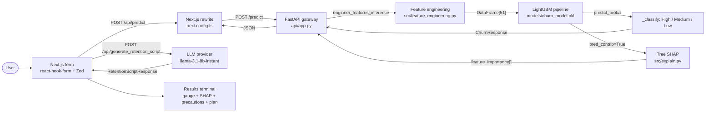

# Churn Engine

A production-shaped customer churn prediction system: a 51-column
LightGBM inference pipeline with mathematically verified Tree-SHAP
attributions, a FastAPI service that exposes single-record and batch
scoring, and a Next.js dashboard that grounds an LLM-generated
retention plan in the model's actual drivers.

## Live

- **Dashboard:** https://customerchurnengine.vercel.app
- **API:** https://indianfincher-churn-engine.hf.space
- **Swagger UI:** https://indianfincher-churn-engine.hf.space/docs
- **Health:** https://indianfincher-churn-engine.hf.space/health

## Highlights

- **Mathematically verified SHAP parity.** Every per-feature
  contribution sums (with the bias term) to the model's log-odds to
  numerical precision. A regression test pins the identity at
  `1e-6` tolerance so the property cannot drift.
- **Centralized request interceptor.** Every outbound API call from
  the Next.js app routes through a single `apiFetch` helper that
  attaches the user's LLM provider key and model selection as
  `X-Provider-Key` and `X-Provider-Model` headers. Settings changes
  propagate to all requests without a page reload.
- **Resilient state.** Zustand stores use a defensive `migrate` +
  `merge` pair so legacy or corrupt `localStorage` payloads can
  never crash rehydration. SSR is guarded via `createJSONStorage`.
- **Engineered, not invented.** The retention-script prompt is
  anchored on the top SHAP drivers; missing key or LLM failure
  returns a labelled static plan tagged `[Default Action Plan]`.

## Architecture



## Stack

| Layer | Choice |
|---|---|
| Frontend | Next.js 16 (Turbopack), React 19, TypeScript, Zustand 5, Zod 4, react-hook-form, Tailwind v4, hand-rolled SVG gauge, Vitest |
| Backend | FastAPI, Pydantic v2, Pandas, LightGBM 4.5+ with native Tree SHAP, slowapi rate limiting, ThreadPoolExecutor for blocking LLM calls |
| LLM | Groq SDK (`llama-3.1-8b-instant` standard, `llama-3.3-70b-versatile` high capacity) |
| Training data | Hugging Face `aai510-group1/telco-customer-churn`, Polars streaming |
| Packaging | Docker Compose, Python 3.11, Node 22 |

## The 51-column inference pipeline

The model is a LightGBM classifier persisted at
`models/churn_model.pkl`. The training pipeline (Polars streaming →
`engineer_features`) produces 51 numeric features from 37 raw form
fields:

- **31 direct numeric / binary inputs** (age, tenure, monthly charge,
  CLTV, satisfaction score, service flags, etc.) — these pass
  through with their raw values.
- **6 categorical fields** (`Gender`, `Contract`, `InternetType`,
  `Offer`, `PaymentMethod`, `SeniorCitizen`) — each one-hot expanded
  against a hard-coded vocabulary so a single-record inference frame
  is shape-compatible with the 50K-row training frame, regardless
  of which categories are present in the input.
- **14 one-hot derived columns** — emitted explicitly to guarantee
  train/inference parity (`Contract_Month_to_Month`,
  `Gender_Female`, `Senior_Citizen_0`, `Offer_null`, etc.).

The hard-coded categories are the only thing that breaks when the
training data is rebuilt. Everything else is regenerated from the
37-field Zod schema on the frontend. A versioned `col_map()` in
`src/feature_engineering.py` is the single source of truth for the
API-field → dataset-column translation.

## Tree-SHAP: the only attribution that actually sums to the model

LightGBM's booster can produce per-feature log-odds contributions
natively via `predict(X, pred_contrib=True)`. The returned matrix is
`(n_samples, n_features + 1)` — the final column is the bias term
(the mean log-odds over the training data). The property that
matters is:

```
f(x) = phi_0 + sum(phi_j)         for j = 1..M
```

For every row we ship to the FE, the sum of per-feature
contributions plus the bias equals `logit(predict_proba(row))` to
within float precision. On a real high-risk record the residual is
**0.0**; the regression test in `tests/test_explain.py` pins it at
`< 1e-6` so the property cannot silently drift.

The FE receives a top-K (default 8) list with each entry shaped as:

```ts
{
  feature: string;     // human-readable label, e.g. "SatisfactionScore"
  value: number | string | null;
  magnitude: number;   // absolute log-odds contribution (>= 0)
  direction: "up" | "down";  // "up" pushes toward churn
}
```

The `direction` field maps 1:1 to the sign of the per-feature
contribution, so the SHAP "f(x) = phi_0 + sum(phi_j)" identity is
preserved end-to-end on the wire.

## Local LLM insights

The retention plan endpoint (`POST /generate_retention_script`) is a
thin orchestrator over a configured LLM provider. The prompt is
**strictly anchored** on the SHAP evidence:

1. The top 3 SHAP drivers are passed as a structured
   `top_drivers: string[]` field.
2. The frontend's client-side precaution list (derived from the
   actual drivers via `deriveRiskSignals` in
   `frontend/src/lib/shap.ts`) is passed as `risk_signals: string[]`.
3. The prompt instructs the model to deliver exactly 3–4
   high-density bullets, each one naming the specific feature and
   magnitude it's grounded in.
4. Output is prefixed `[Action Plan]` on success.

The endpoint is **never allowed to raise**. Missing key, network
failure, or quota exhaustion all route to a labelled static default
plan tagged `[Default Action Plan]`, so the dashboard always has
something to render.

### Per-request override

Users can drop in a different key and switch between
`standard` / `high_capacity` model slots at runtime via the
**Provider Configuration Panel** in the left rail. The panel writes
to the Zustand `useProviderStore`, which is read on every request
by the centralized `apiFetch` interceptor and attached as
`X-Provider-Key` and `X-Provider-Model` headers. The env-loaded
key is the fallback when the header is absent.

## Quickstart

```bash
cp .env.example .env       # add your LLM_PROVIDER_API_KEY (optional)
make dev                   # boots API on :8000 + Next.js on :3000
# Dashboard: http://localhost:3000
# Swagger:  http://127.0.0.1:8000/docs
```

`make dev` honours `BACKEND_PORT` (default 8000) for the API. The
Next.js dev server stays on port 3000 and reads `BACKEND_PORT` to
know where the API is.

### Docker Compose

```bash
cp .env.example .env
docker compose up --build
```

### Native install

```bash
# Backend
python -m venv venv && source venv/bin/activate   # Windows: venv\Scripts\activate
pip install -r requirements.txt -r requirements-dev.txt
python src/train.py                              # writes models/churn_model.pkl
python -m api                                    # honours PORT, default 8000

# Frontend (in a second terminal)
cd frontend
npm install
npm run dev
```

## Configuration

| Variable | Required | Default | Purpose |
|---|---|---|---|
| `LLM_PROVIDER_API_KEY` | For script generation | — | Provider key. If missing, `/generate_retention_script` returns the labelled fallback and logs `LLM_PROVIDER_KEY_MISSING`. |
| `LLM_STANDARD_MODEL` | No | `llama-3.1-8b-instant` | Model id for the "standard" slot. |
| `LLM_HIGH_CAPACITY_MODEL` | No | `llama-3.3-70b-versatile` | Model id for the "high_capacity" slot. |
| `HF_TOKEN` | Only if dataset is gated | — | Hugging Face token for training data download. Not needed for inference. |
| `LIMITER_ENABLED` | No | `true` | Set to `false` to disable the slowapi rate limiter (CI / load tests). |
| `PORT` | No | `8000` | FastAPI listen port. |
| `BACKEND_PORT` | No | `8000` | Port the Next.js rewrite target points at. |
| `BACKEND_INTERNAL_URL` | For split-host | `http://127.0.0.1:$BACKEND_PORT` | Full backend origin. Set to the HF Space URL on the Vercel project so the rewrite forwards `/api/*` to the live API. |
| `CORS_ORIGINS` | No | dev + production Vercel | Comma-separated list of allowed origins. |

`LLM_PROVIDER_API_KEY` is read once at API startup via
`load_dotenv(..., override=False)`, so platform-injected env vars
always win over a local `.env`. `.env` is gitignored.

## API

| Method | Path | Rate limit | Description |
|---|---|---|---|
| `GET`  | `/health`                    | 30/min | Health probe (model loaded, path). |
| `GET`  | `/llm/models`                | 30/min | LLM catalog used by the Provider Panel. |
| `POST` | `/predict`                   | 10/min | Single-record churn prediction with `feature_importance`. |
| `POST` | `/predict/batch`             | 30/min | Batch prediction; per-row risk + per-row SHAP. |
| `POST` | `/generate_retention_script` | 5/min  | Retention plan via the configured LLM provider. |

Full OpenAPI is served at `/docs` and `/redoc`.

### Single prediction

```bash
curl -X POST http://127.0.0.1:8000/predict \
  -H "Content-Type: application/json" \
  -d '{
    "Gender": "Male",
    "SeniorCitizen": 0,
    "Partner": 0,
    "tenure": 2,
    "PhoneService": 1,
    "InternetService": 1,
    "Contract": "Month-to-Month",
    "PaperlessBilling": 1,
    "PaymentMethod": "Bank Withdrawal",
    "MonthlyCharges": 95.0,
    "TotalCharges": 190.0
  }'
```

Risk tiers: `>= 0.70` → High, `>= 0.40` → Medium, otherwise Low.

`feature_importance` is the top-K (default 8) Tree SHAP
contributions. Each entry has the human-readable feature label, the
customer value, the absolute magnitude (log-odds), and the direction
(`"up"` pushes toward churn). `null` if SHAP extraction fails — the
primary prediction always succeeds independently.

### Retention plan

```bash
curl -X POST http://127.0.0.1:8000/generate_retention_script \
  -H "Content-Type: application/json" \
  -H "X-Provider-Key: $LLM_PROVIDER_API_KEY" \
  -H "X-Provider-Model: high_capacity" \
  -d '{
    "risk_level": "High",
    "reasons": "SatisfactionScore=1, tenure=2mo.",
    "top_drivers": [
      "SatisfactionScore (0.42)",
      "Tenure_in_Months (0.18)"
    ],
    "risk_signals": [
      "Satisfaction-recovery outreach",
      "Early-tenure retention play"
    ],
    "probability_pct": 78.5
  }'
```

The optional `top_drivers`, `risk_signals`, and `probability_pct`
fields weave the SHAP evidence and the practical-precaution list
into the prompt. The two-field `risk_level` + `reasons` payload is
still accepted for back-compat.

## Project layout

```
.
├── api/
│   ├── __init__.py
│   ├── __main__.py                # `python -m api` entry point
│   └── app.py                     # FastAPI: /predict, /predict/batch,
│                                  # /generate_retention_script, /llm/models, /health
├── src/
│   ├── config.py                  # DATA_CONFIG, MODEL_CONFIG, LIGHTGBM_CONFIG, MLFLOW_CONFIG
│   ├── explain.py                 # Tree SHAP extraction (pred_contrib + bias)
│   ├── feature_engineering.py     # engineer_features_inference (Pandas),
│   │                              # engineer_features (Polars, training)
│   ├── predict.py                 # CLI inference
│   └── train.py                   # Polars streaming → LightGBM training
├── frontend/src/
│   ├── app/                       # layout, page, parameters, analysis, status
│   ├── components/                # AppShell, RiskGauge, ShapPanel,
│   │                              # CopyButton, ProviderPanel, ErrorBoundary, ui/
│   ├── data/presets.ts            # highRisk + loyal customer profiles
│   ├── hooks/useHealthSubscription.ts
│   ├── lib/                       # api, cn, schema, binaryFields, llm, shap
│   ├── store/                     # useFormStore, useResultStore,
│   │                              # useHealthStore, useProviderStore
│   ├── types/api.ts
│   └── tests/                     # vitest unit + integration tests
├── tests/                         # pytest (test_api, test_src,
│                                  # test_explain, integration)
├── load_tests/locustfile.py       # concurrent load probe
├── models/churn_model.pkl
├── .github/workflows/ci.yml
├── deploy_huggingface.py          # HF Space provisioning (HfApi, os.environ)
├── .env.example
├── docker-compose.yml             # local full-stack boot
├── vercel.json                    # Vercel build config (rewrites in next.config.ts)
├── Dockerfile
├── Makefile
├── requirements.txt
├── requirements-dev.txt
└── README.md
```

## Testing

```bash
# Backend
python -m pytest tests/ -v
python -m pytest tests/ --cov=api --cov=src --cov-report=term-missing

# Frontend
cd frontend && npx vitest run
cd frontend && npm run build
```

The LLM provider SDK is mocked in all tests; the live key is only
read when the API runs against a real deployment. The SHAP parity
test in `tests/test_explain.py` runs against the real model
artifact and pins the `f(x) = phi_0 + sum(phi_j)` identity at
`1e-6` tolerance.

## Operational notes

- **Rate limits:** 30/min global default, 10/min on `/predict`, 5/min
  on `/generate_retention_script`.
- **CORS:** the default tuple includes the production Vercel
  origin (`https://frontend-pi-sage-79.vercel.app`) plus the
  local dev origins. Set `CORS_ORIGINS` to a comma-separated list
  to add staging, custom domains, or to remove the defaults.
- **Model artifact:** `models/churn_model.pkl` is loaded once at
  startup via `joblib.load`. Only load artifacts from a trusted
  source — joblib is pickle-based.
- **Docker:** the API image expects `models/churn_model.pkl` to be
  present at build time. `docker-compose.yml` bind-mounts `./models`
  over the image's `models/` so the image alone will not start
  without a model on disk.
- **No authentication:** by design this is an internal tool. The
  rate limiter is the only protection on
  `/generate_retention_script`, which incurs a per-call LLM cost.

## License

MIT. See [LICENSE](./LICENSE).
