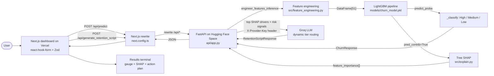

# Churn Engine

This started as a third-year college project. The first version was a
plain churn prediction script: load a telco dataset, train a model,
print the accuracy, done. It ran once on my machine and nobody,
including me, could actually use it.

Later I decided to rebuild the whole thing properly, mostly as a way to
learn how a real project fits together. I picked the stack myself and
learned why each piece earns its place. LightGBM for the model, mainly
because it can produce Tree-SHAP attributions natively, which turned
out to be the core of the explainability side. FastAPI for the backend
API. Next.js with TypeScript for the dashboard. Then all the parts
classwork skips: keeping everything in Git and GitHub, adding automated
checks with GitHub Actions, writing tests that actually run, deploying
the backend to Hugging Face Spaces, deploying the frontend to Vercel,
and testing the deployed app in a real browser.

I am not claiming this is the best possible stack or the best possible
model; on this dataset a logistic regression scores about the same.
It is a project I learned a lot from, and unlike the notebook version,
it is deployed and working.

## Live

- **Dashboard:** https://customer-churn-engine.vercel.app
- **API:** https://indianfincher-churn-engine.hf.space
- **Swagger UI:** https://indianfincher-churn-engine.hf.space/docs
- **Health:** https://indianfincher-churn-engine.hf.space/health

## Design notes

- **SHAP parity is pinned by a test.** Every per-feature
  contribution sums (with the bias term) to the model's log-odds to
  numerical precision. A regression test holds the identity at
  `1e-6` tolerance so the property cannot drift.
- **One request interceptor.** Every outbound API call from
  the Next.js app routes through a single `apiFetch` helper that
  attaches the user's LLM provider key and model selection as
  `X-Provider-Key` and `X-Provider-Model` headers, so settings
  changes propagate without a page reload.
- **Defensive state.** Zustand stores use a `migrate` + `merge`
  pair so legacy or corrupt `localStorage` payloads cannot crash
  rehydration. SSR is guarded via `createJSONStorage`.
- **Grounded LLM output.** The retention-script prompt is anchored
  on the top SHAP drivers; a missing key or LLM failure returns a
  labelled static plan tagged `[Default Action Plan]`.

## Architecture


```mermaid
flowchart LR
  User([User]) --> Form[Next.js dashboard on Vercel<br/>react-hook-form + Zod]
  Form -- "POST /api/predict" --> Next[Next.js rewrite<br/>next.config.ts]
  Form -- "POST /api/generate_retention_script" --> Next
  Next -- "rewrite /api/*" --> API[FastAPI on Hugging Face Space<br/>api/app.py]
  API -- "engineer_features_inference" --> FE[Feature engineering<br/>src/feature_engineering.py]
  FE -- "DataFrame[51]" --> LGBM[LightGBM pipeline<br/>models/churn_model.pkl]
  LGBM -- "predict_proba" --> Class[_classify: High / Medium / Low]
  LGBM -- "pred_contrib=True" --> SHAP[Tree SHAP<br/>src/explain.py]
  Class -- "ChurnResponse" --> API
  SHAP -- "feature_importance[]" --> API
  API -- "top SHAP drivers + risk signals<br/>X-Provider-Key header" --> LLM[Groq LLM<br/>dynamic tier routing]
  LLM -- "RetentionScriptResponse" --> API
  API -- "JSON" --> Next
  Next --> Form
  Form --> Results[Results terminal<br/>gauge + SHAP + action plan]
```

## Stack

| Layer | Choice |
|---|---|
| Frontend | Next.js 16 (Turbopack), React 19, TypeScript, Zustand 5, Zod 4, react-hook-form, Tailwind v4, hand-rolled SVG gauge, Vitest |
| Backend | FastAPI, Pydantic v2, Pandas, LightGBM 4.5+ with native Tree SHAP, slowapi rate limiting, ThreadPoolExecutor for blocking LLM calls |
| LLM | Groq SDK with dynamic model routing (standard / high-capacity tiers, resolved live from the provider catalog) |
| Training data | Hugging Face `aai510-group1/telco-customer-churn` (4,225 rows, 26.5% churn), Polars streaming |
| Packaging | Docker Compose, Python 3.11, Node 22 |

## The 51-column inference pipeline

The model is a LightGBM classifier persisted at
`models/churn_model.pkl`. The training pipeline (Polars streaming into
`engineer_features`) produces 51 numeric features from 37 raw form
fields:

- **31 direct numeric / binary inputs** (age, tenure, monthly charge,
  CLTV, satisfaction score, service flags, etc.); these pass
  through with their raw values.
- **6 categorical fields** (`Gender`, `Contract`, `InternetType`,
  `Offer`, `PaymentMethod`, `SeniorCitizen`) each one-hot expanded
  against a hard-coded vocabulary so a single-record inference frame
  is shape-compatible with the 4,225-row training frame, regardless
  of which categories are present in the input.
- **14 one-hot derived columns**, emitted explicitly to guarantee
  train/inference parity (`Contract_Month_to_Month`,
  `Gender_Female`, `Senior_Citizen_0`, `Offer_null`, etc.).

The hard-coded categories are the only thing that breaks when the
training data is rebuilt. Everything else is regenerated from the
37-field Zod schema on the frontend. A versioned `col_map()` in
`src/feature_engineering.py` is the single source of truth for the
API-field to dataset-column translation.

## Model performance (independently reproduced)

The committed artifact (`models/churn_model.pkl`) was retrained from
scratch (same seed, same config, fresh download of the public dataset)
and scored on a stratified 20% holdout that the model never saw:

| Metric | Retrained | Committed artifact |
|---|---|---|
| ROC-AUC | 0.994 | 0.994 (identical) |
| PR-AUC | 0.986 | n/a |
| F1 (churn class) | 0.927 | 0.927 |
| Brier score | 0.028 | 0.028 |
| Churn rate | 26.5% | n/a |

Honest baseline context: on this dataset the classes are highly
separable, so a plain logistic regression reaches ROC-AUC 0.994,
statistically indistinguishable from the LightGBM model. LightGBM is
kept for its native `pred_contrib=True` Tree-SHAP support, which is
what powers the explainability features. A majority-class dummy
baseline sits at 0.735 accuracy / 0.5 AUC.

## Tree-SHAP: the only attribution that actually sums to the model

LightGBM's booster can produce per-feature log-odds contributions
natively via `predict(X, pred_contrib=True)`. The returned matrix is
`(n_samples, n_features + 1)`; the final column is the bias term
(the mean log-odds over the training data). The property that
matters is:

```
f(x) = phi_0 + sum(phi_j)         for j = 1..M
```

For every row we ship to the FE, the sum of per-feature
contributions plus the bias equals `logit(predict_proba(row))` to
within float precision. On a real high-risk record the residual is
**0.0**; the regression test in `tests/test_explain.py` pins it at
`< 1e-6` so the property cannot silently drift.

The FE receives a top-K (default 8) list with each entry shaped as:

```ts
{
  feature: string;     // human-readable label, e.g. "SatisfactionScore"
  value: number | string | null;
  magnitude: number;   // absolute log-odds contribution (>= 0)
  direction: "up" | "down";  // "up" pushes toward churn
}
```

The `direction` field maps 1:1 to the sign of the per-feature
contribution, so the SHAP "f(x) = phi_0 + sum(phi_j)" identity is
preserved end-to-end on the wire.

## Local LLM insights

The retention plan endpoint (`POST /generate_retention_script`) is a
thin orchestrator over a configured LLM provider. The prompt is
**strictly anchored** on the SHAP evidence:

1. The top 3 SHAP drivers are passed as a structured
   `top_drivers: string[]` field.
2. The frontend's client-side precaution list (derived from the
   actual drivers via `deriveRiskSignals` in
   `frontend/src/lib/shap.ts`) is passed as `risk_signals: string[]`.
3. The prompt instructs the model to deliver exactly 3 to 4
   high-density bullets, each one naming the specific feature and
   magnitude it's grounded in.
4. Output is prefixed `[Action Plan]` on success.

The endpoint is **never allowed to raise**. Missing key, network
failure, or quota exhaustion all route to a labelled static default
plan tagged `[Default Action Plan]`, so the dashboard always has
something to render.

### Per-request override

Users can drop in a different key and switch between
`standard` / `high_capacity` model slots at runtime via the
**Provider Configuration Panel** in the left rail. The panel writes
to the Zustand `useProviderStore`, which is read on every request
by the centralized `apiFetch` interceptor and attached as
`X-Provider-Key` and `X-Provider-Model` headers. The env-loaded
key is the fallback when the header is absent.

## Quickstart

```bash
cp .env.example .env       # add your LLM_PROVIDER_API_KEY (optional)
make dev                   # boots API on :8000 + Next.js on :3000
# Dashboard: http://localhost:3000
# Swagger:  http://127.0.0.1:8000/docs
```

`make dev` honours `BACKEND_PORT` (default 8000) for the API. The
Next.js dev server stays on port 3000 and reads `BACKEND_PORT` to
know where the API is.

### Docker Compose

```bash
cp .env.example .env
docker compose up --build
```

### Native install

```bash
# Backend
python -m venv venv && source venv/bin/activate   # Windows: venv\Scripts\activate
pip install -r requirements.txt -r requirements-dev.txt
python src/train.py                              # writes models/churn_model.pkl
python -m api                                    # honours PORT, default 8000

# Frontend (in a second terminal)
cd frontend
npm install
npm run dev
```

## Configuration

| Variable | Required | Default | Purpose |
|---|---|---|---|
| `LLM_PROVIDER_API_KEY` | For script generation | (none) | Provider key. If missing, `/generate_retention_script` returns the labelled fallback and logs `LLM_PROVIDER_KEY_MISSING`. |
| `LLM_STANDARD_MODEL` | No | dynamic discovery | Optional pin for the "standard" tier id. Unset, the id is selected automatically from the provider's live catalog (middle-intelligence chat model). |
| `LLM_HIGH_CAPACITY_MODEL` | No | dynamic discovery | Optional pin for the "high_capacity" tier id. Unset, the id is selected automatically from the provider's live catalog (highest-intelligence chat model). |
| `HF_TOKEN` | Only if dataset is gated | (none) | Hugging Face token for training data download. Not needed for inference. |
| `LIMITER_ENABLED` | No | `true` | Set to `false` to disable the slowapi rate limiter (CI / load tests). |
| `PORT` | No | `8000` | FastAPI listen port. |
| `BACKEND_PORT` | No | `8000` | Port the Next.js rewrite target points at. |
| `BACKEND_INTERNAL_URL` | For split-host | `http://127.0.0.1:$BACKEND_PORT` | Full backend origin. Set to the HF Space URL on the Vercel project so the rewrite forwards `/api/*` to the live API. |
| `CORS_ORIGINS` | No | dev + production Vercel | Comma-separated list of allowed origins. |

`LLM_PROVIDER_API_KEY` is read once at API startup via
`load_dotenv(..., override=False)`, so platform-injected env vars
always win over a local `.env`. `.env` is gitignored.

## API

| Method | Path | Rate limit | Description |
|---|---|---|---|
| `GET`  | `/health`                    | 30/min | Health probe (model loaded, path). |
| `GET`  | `/llm/models`                | 30/min | LLM catalog used by the Provider Panel. |
| `POST` | `/predict`                   | 10/min | Single-record churn prediction with `feature_importance`. |
| `POST` | `/predict/batch`             | 30/min | Batch prediction; per-row risk + per-row SHAP. |
| `POST` | `/generate_retention_script` | 5/min  | Retention plan via the configured LLM provider. |

Full OpenAPI is served at `/docs` and `/redoc`.

### Single prediction

```bash
curl -X POST http://127.0.0.1:8000/predict \
  -H "Content-Type: application/json" \
  -d '{
    "Gender": "Male",
    "SeniorCitizen": 0,
    "Partner": 0,
    "tenure": 2,
    "PhoneService": 1,
    "InternetService": 1,
    "Contract": "Month-to-Month",
    "PaperlessBilling": 1,
    "PaymentMethod": "Bank Withdrawal",
    "MonthlyCharges": 95.0,
    "TotalCharges": 190.0
  }'
```

Risk tiers: `>= 0.70` is High, `>= 0.40` is Medium, otherwise Low.

`feature_importance` is the top-K (default 8) Tree SHAP
contributions. Each entry has the human-readable feature label, the
customer value, the absolute magnitude (log-odds), and the direction
(`"up"` pushes toward churn). `null` if SHAP extraction fails; the
primary prediction always succeeds independently.

### Retention plan

```bash
curl -X POST http://127.0.0.1:8000/generate_retention_script \
  -H "Content-Type: application/json" \
  -H "X-Provider-Key: $LLM_PROVIDER_API_KEY" \
  -H "X-Provider-Model: high_capacity" \
  -d '{
    "risk_level": "High",
    "reasons": "SatisfactionScore=1, tenure=2mo.",
    "top_drivers": [
      "SatisfactionScore (0.42)",
      "Tenure_in_Months (0.18)"
    ],
    "risk_signals": [
      "Satisfaction-recovery outreach",
      "Early-tenure retention play"
    ],
    "probability_pct": 78.5
  }'
```

The optional `top_drivers`, `risk_signals`, and `probability_pct`
fields weave the SHAP evidence and the practical-precaution list
into the prompt. The two-field `risk_level` + `reasons` payload is
still accepted for back-compat.

## Project layout

```
.
├── api/
│   ├── __init__.py
│   ├── __main__.py                # `python -m api` entry point
│   └── app.py                     # FastAPI: /predict, /predict/batch,
│                                  # /generate_retention_script, /llm/models, /health
├── src/
│   ├── __init__.py
│   ├── config.py                  # DATA_CONFIG, MODEL_CONFIG, LIGHTGBM_CONFIG, MLFLOW_CONFIG
│   ├── explain.py                 # Tree SHAP extraction (pred_contrib + bias)
│   ├── feature_engineering.py     # engineer_features (Polars, training) and
│   │                              # engineer_features_inference (Pandas)
│   ├── predict.py                 # CLI inference
│   └── train.py                   # Polars streaming into LightGBM training
├── frontend/
│   ├── Dockerfile                 # standalone Next.js container build
│   ├── next.config.ts             # backend rewrites, build output switch
│   ├── playwright.config.ts       # E2E suite (CI, Chromium + Firefox)
│   ├── playwright.prod.config.ts  # E2E against the live deployment (serial)
│   ├── vitest.config.ts
│   ├── tests/e2e/                 # Playwright specs
│   └── src/                       # app/, components/, lib/, store/, hooks/,
│                                  # data/, types/, tests/
├── tests/                         # test_api, test_src, test_explain,
│                                  # test_sensitivity, test_live_production,
│                                  # integration/
├── load_tests/locustfile.py       # concurrent load probe
├── models/churn_model.pkl         # committed LightGBM artifact
├── .github/workflows/ci.yml       # backend and frontend CI jobs
├── deploy_huggingface.py          # HF Space provisioning (HfApi)
├── .dockerignore
├── .env.example
├── .flake8
├── docker-compose.yml             # local full-stack boot
├── vercel.json
├── Dockerfile                     # API image (Python 3.11 slim)
├── Makefile
├── pytest.ini
├── LICENSE
├── requirements.txt
├── requirements-dev.txt
└── README.md
```

## Testing

```bash
# Backend: lint, tests, coverage (CI runs exactly this)
flake8 api/ src/
python -m pytest tests/ --cov=api --cov=src --cov-report=term-missing

# Frontend: lint, typecheck, unit + integration tests
cd frontend && npm run lint
cd frontend && npx tsc --noEmit
cd frontend && npm test

# Frontend: production build + Playwright E2E (spins up a dev server,
# exercises the full form and results flow with mocked network routes)
cd frontend && npm run build
cd frontend && npm run e2e
```

CI (`.github/workflows/ci.yml`) runs on every push and PR to `master`
as two parallel jobs - backend (flake8, pytest with an 80% coverage
floor) and frontend (eslint, tsc, vitest, production build, Playwright
E2E on Chromium and Firefox).

The LLM provider SDK is mocked in all tests; the live key is only
read when the API runs against a real deployment. The SHAP parity
test in `tests/test_explain.py` runs against the real model
artifact and pins the `f(x) = phi_0 + sum(phi_j)` identity at
`1e-6` tolerance.

The E2E suite under `frontend/tests/e2e/` also includes
`prod-audit.spec.ts`, a serial 22-scenario release gate that runs
against the live deployment via `playwright.prod.config.ts`
(`npx playwright test -c playwright.prod.config.ts`). It is not
part of CI because it depends on external uptime, shared rate
limits, and a live LLM key.

## Deployment

- **Frontend (Vercel):** the repository is connected to the
  `customer-churn-engine` Vercel project; every push to `master`
  triggers a production deployment. Root directory is `frontend`,
  framework detection is Next.js, no custom install or build
  command. The project needs `BACKEND_INTERNAL_URL` set to the
  Hugging Face Space URL so the `/api/*` rewrites reach the live
  API. The provider key is never set on the frontend; users may
  supply their own via the in-app Provider panel, which is sent as
  a request header and handled server-side.
- **Backend (Hugging Face Spaces):** a Docker Space running the
  FastAPI app from this repo's `Dockerfile`. `deploy_huggingface.py`
  provisions and pushes the Space with `HfApi`. The Space secret
  `LLM_PROVIDER_API_KEY` enables live retention plans; without it
  the labelled fallback plan is returned. The Space URL must be
  listed in `CORS_ORIGINS`-reachable defaults (the production
  Vercel origin is included by default).

## Limitations

- The model is trained on a single telco dataset (4,225 rows); it
  is not a general churn model and expects the 37-field schema the
  form produces.
- The classes are highly separable in this dataset, so headline
  metrics overstate how hard the problem is; treat the scores as
  dataset-relative, not as a benchmark.
- No authentication and no persistence: results live in the
  browser, rate limits are the only abuse protection, and the
  `/generate_retention_script` endpoint incurs a per-call LLM cost.
- Client-side validation duplicates the backend schema; if the Zod
  schema and the trained feature vocabulary drift apart, the
  hard-coded category maps in `src/feature_engineering.py` are the
  single place to reconcile.

## Operational notes

- **Rate limits:** 30/min global default, 10/min on `/predict`, 5/min
  on `/generate_retention_script`.
- **CORS:** the default tuple includes the production Vercel
  origin (`https://customer-churn-engine.vercel.app`) plus the
  local dev origins. Set `CORS_ORIGINS` to a comma-separated list
  to add staging, custom domains, or to remove the defaults.
- **Model artifact:** `models/churn_model.pkl` is loaded once at
  startup via `joblib.load`. Only load artifacts from a trusted
  source; joblib is pickle-based.
- **Docker:** the API image expects `models/churn_model.pkl` to be
  present at build time. `docker-compose.yml` bind-mounts `./models`
  over the image's `models/` so the image alone will not start
  without a model on disk.
- **No authentication:** by design this is an internal tool. The
  rate limiter is the only protection on
  `/generate_retention_script`, which incurs a per-call LLM cost.

## License

MIT. See [LICENSE](./LICENSE).
